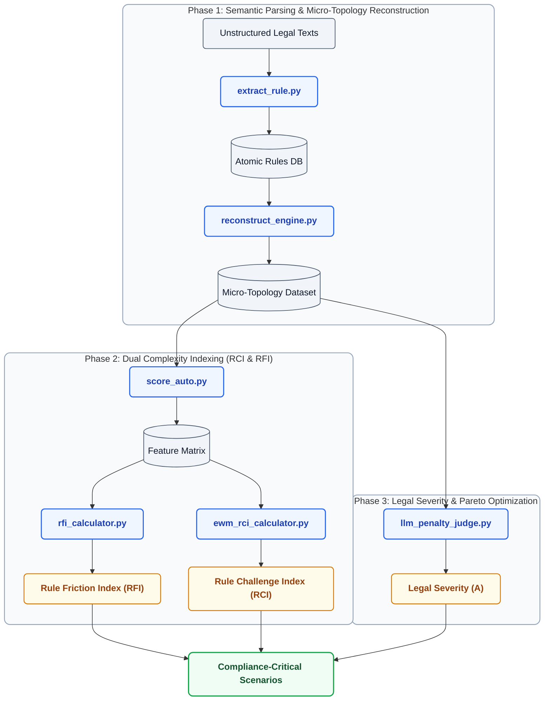

<div align="center">

# 🚦 CCS-Bench: Beyond Physical Risk
### Compliance-Critical Intersection Scenario Benchmark

[](https://www.python.org/)
[](LICENSE)
[](https://api.siliconflow.cn/)
[]()

*This repository contains the code implementation and benchmark dataset accompanying the paper:*  
**"Beyond Physical Risk: Identifying Compliance-Critical Intersection Scenarios through Traffic-Rule Complexity Quantification"**

</div>

---

## 📖 Key Research Highlights

- **Motivation**: Existing scenario selection approaches prioritize physical risk (kinematic severity), often missing kinematically benign yet **compliance-critical** scenarios caused by ambiguous, overlapping, or conflicting traffic regulations.
- **Dual Complexity Indexing**:
  - **Rule Challenge Index (RCI)**: Quantifies *intra-rule* interpretive burden (semantic fuzziness depth, right-of-way clarity, and topological action complexity).
  - **Rule Friction Index (RFI)**: Quantifies *inter-rule* systemic coupling (rule coupling density, priority entropy, and rule volume).


---

## 🏗️ Repository Architecture & Framework Pipeline

The **CCS-Bench** pipeline consists of 3 sequential, modular phases:



<br/>

### 🛠️ Script Modules Breakdown

| Module / Script | Phase | Role & Technical Description |
| :--- | :---: | :--- |
| `extract_rule.py` | **Phase 1a** | **Semantic Parser**: Executes LLM hybrid AST chunking on raw Markdown traffic legal texts to extract atomic structured rules matching Pydantic schemas. |
| `reconstruct_engine.py` | **Phase 1b** | **Micro-Topology Engine (微观拓扑重建引擎)**: Reads scored tables containing initial legal texts, invokes LLM to atomize each rule into micro-topology interaction dictionaries with 5 standard topology keys (`macro_scenario`, `ego_action`, `other_action`, `interactive_entity`, `control_type`). Includes MD5 deduplication, local checkpoint resumption, and deterministic macro-scenario pre-explosion to prevent LLM omissions. |
| `score_auto.py` | **Phase 2a** | **Indicator Evaluator**: Computes quantitative feature scores across legal severity ($A$), fuzziness ($B$), right-of-way clarity ($C$), and topology complexity ($D$). |
| `rfi_calculator.py` | **Phase 2b** | **Inter-Rule Coupling Pipeline**: Constructs NetworkX ontology interaction graphs, calculates rule coupling density, priority entropy, and EWM weights. |
| `ewm_rci_calculator.py` | **Phase 2c** | **Intra-Rule Challenge Engine**: Folds non-ego micro-topologies, flags state divergence ($C_{\text{divergence}}$), applies objective EWM weighting for RCI scores. |
| `llm_penalty_judge.py` | **Phase 3** | **AI Legal Judge**: Evaluates rule violation severities against global legal penalty catalogs using LLM judges, backfilling $A_{\text{LLM}}$ ratings. |

---

## ⚡ Environment & Setup

### 1. Installation

Ensure **Python 3.9+** is installed, then install core dependencies:

```bash
pip install pandas numpy networkx openai pydantic openpyxl matplotlib langchain-text-splitters
```

### 2. API Key & Model Configuration

Configure environment variables for **SiliconFlow**, **Alibaba Cloud DashScope**, or OpenAI-compatible endpoints:

| Environment Variable | Recommended Value | Description |
| :--- | :--- | :--- |
| `SILICONFLOW_API_KEY` | `your_api_key_here` | API key for LLM inference |
| `SILICONFLOW_BASE_URL` | `https://api.siliconflow.cn/v1` | API base endpoint |
| `SILICONFLOW_MODEL` | `qwen3.6-plus` | LLM model engine |

**Windows PowerShell Example:**
```powershell
$env:SILICONFLOW_API_KEY="your_api_key_here"
$env:SILICONFLOW_BASE_URL="https://api.siliconflow.cn/v1"
$env:SILICONFLOW_MODEL="qwen3.6-plus"
```

**Linux / macOS Bash Example:**
```bash
export SILICONFLOW_API_KEY="your_api_key_here"
export SILICONFLOW_BASE_URL="https://api.siliconflow.cn/v1"
export SILICONFLOW_MODEL="qwen3.6-plus"
```

---

## 🚀 Quick Start Guide

```bash
# Step 1: Extract atomic structured rules from raw Markdown legal texts
python extract_rule.py --input-dir "./法规文件的markdown文件" --output-dir "./compiled_rules"

# Step 2: Reconstruct micro-topologies and compute quantitative indicator scores
python reconstruct_engine.py
python score_auto.py

# Step 3: Compute Rule Friction Index (RFI) across jurisdictions
python rfi_calculator.py data-case.xlsx

# Step 4: Compute Rule Challenge Index (RCI) and perform topological folding
python ewm_rci_calculator.py --mode evaluate

# Step 5: Run AI LLM Penalty Severity Judges
python llm_penalty_judge.py
```

---

## 📊 Benchmark Dataset (`data-case.xlsx`)

The repository includes `data-case.xlsx` as an example dataset, containing **1,000 rule topology records extracted and reconstructed from original traffic legal texts**. All records have been verified through a dual-review process involving **human expert inspection** and an **independent LLM cross-validation** before being finalized. This 1,000-record sample is drawn from the verified production dataset.

Each record contains:
- 📜 **Raw Legal Clause & Translation**: Original legal text (`包含的法规原文`) and Chinese translation (`包含的中文翻译`).
- 🚘 **Structured Micro-Topology**: Macro scenario (`宏观场景`), ego maneuver (`自车动作(拓扑)`), interactive entity (`交互对象(条件)`), other entity maneuver (`他车动作(拓扑)`), and signal control type (`信控类型`).
- 📈 **Multi-Indicator Features**: Right-of-way clarity ($C_1$), special preemption ($C_2$), fuzziness depth ($B_2$), normalized fuzziness count ($B_1$), state divergence ($C_{\text{divergence}}$), and topological complexity ($D$).
- 🧮 **Dual Complexity Metrics**: Pre-computed Rule Challenge Index (`RCI`) and Rule Friction Index (`RFI`).

---

## 📄 License

This project is released under the [MIT License](LICENSE).
